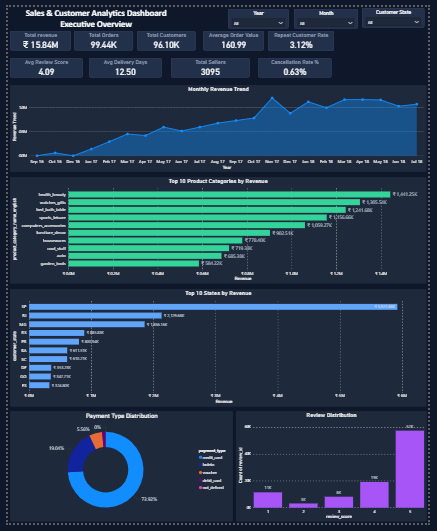
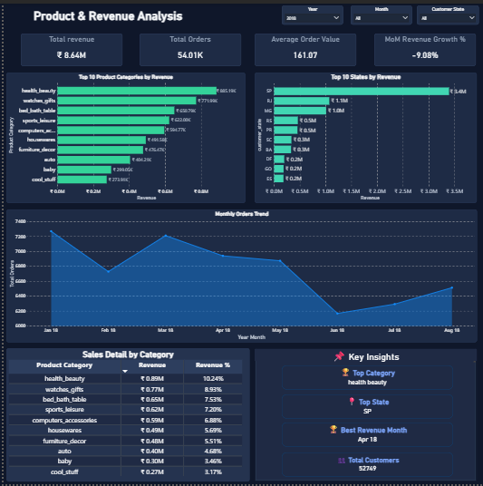
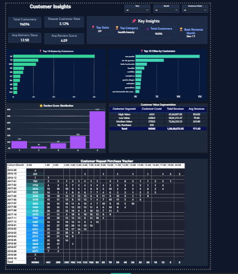

# Olist Sales & Customer Analytics Dashboard

## Project Overview

An end-to-end Data Analytics project built using MySQL and Power BI on the Olist E-commerce dataset.

The project analyzes sales performance, customer behavior, product categories, payment methods, and regional trends to generate actionable business insights.

---

## Tech Stack

- MySQL
- Power BI
- Power Query
- DAX
- Data Modeling
- Data Visualization

---

## Project Workflow

1. Imported Olist E-commerce data into MySQL.
2. Performed data exploration and analysis using SQL queries.
3. Connected MySQL data to Power BI.
4. Created calculated measures using DAX.
5. Built interactive dashboards for business decision-making.

---

## Dashboard Pages

### Executive Overview
- Total Revenue
- Total Orders
- Total Customers
- Average Order Value
- Repeat Customer Rate
- Revenue Trend
- Top Product Categories
- Top States by Revenue

---

### Sales Analysis
- Revenue by Product Category
- Revenue Contribution %
- Monthly Orders Trend
- State-wise Revenue Analysis
- Key Business Insights

---

### Customer Insights
- Customer Distribution by State
- Customer Distribution by City
- Review Score Distribution
- Average Review Score by State
- Customer Satisfaction Analysis

---

## Key Business Insights

- Health & Beauty is the highest revenue-generating category.
- São Paulo (SP) contributes the highest revenue and customer count.
- Most customers have provided a review score of 5, indicating strong satisfaction.
- Credit Card is the most preferred payment method.
- Revenue experienced significant growth during late 2017 and early 2018.

---

## Business Value

This dashboard helps businesses:

- Identify top-performing products and regions.
- Track sales and revenue trends.
- Understand customer satisfaction levels.
- Monitor customer distribution across states and cities.
- Support data-driven decision making.

---

## Dataset

Source: Olist Brazilian E-commerce Dataset

---

## Note

Due to GitHub file size limitations, the PBIX file is not included in this repository. Dashboard screenshots and project documentation are provided for portfolio purposes.
