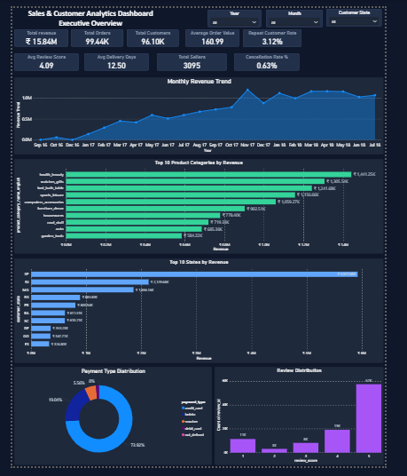

# Olist Sales & Customer Analytics Dashboard

An end-to-end Business Intelligence project analyzing the Olist Brazilian e-commerce dataset — built with **MySQL** (data layer) and **Power BI** (visualization + DAX), extended with a **Python + Gemini API** layer that auto-generates written business insights from the dashboard's metrics.

---

## 📊 Business Problem

Olist is a Brazilian e-commerce platform connecting small merchants to major marketplaces. This project analyzes order, customer, payment, and review data to answer:

- Where does revenue come from (categories, states, time trends)?
- How well does Olist retain customers after their first purchase?
- Which customers drive the most value, and how are they distributed?
- Does customer satisfaction correlate with repeat business?

---

## 🛠️ Tools & Approach

- **MySQL** — raw data cleaning, transformation, and a star-schema model (customers, orders, order_items, order_payments, order_reviews, products, sellers)
- **Power BI + DAX** — dashboard build, custom measures for revenue, retention, and segmentation
- **Python + Google Gemini API** — automated AI-generated insight reports from dashboard metrics (see [AI Insights](#-ai-generated-insights) below)

---

## 📈 Dashboard Overview

### Page 1: Executive Overview
High-level KPIs (Revenue, Orders, AOV, Repeat Rate, Review Score, Delivery Days, Cancellation Rate), monthly revenue trend, top categories and states, payment type distribution.



### Page 2: Product & Revenue Analysis
Deeper drill-down into category and state-level revenue, monthly order trends, MoM growth, and key insight callouts.


### Page 3: Customer Insights
Customer-level analysis including geographic distribution, review scores, a **Cohort Retention Matrix** ("Customer Repeat Purchase Tracker"), and a **Customer Value Segmentation** table ("Customer Spending Tiers").


---

## 🔑 Key Insights

**1. Severe retention drop-off.** Only 3.12% of customers make a repeat purchase. The cohort retention matrix shows this holds true across every signup cohort from Sep 2016 to Oct 2018 — roughly 98% of all purchase activity is first-time only, with repeat purchases dropping to near-zero within a month of first order, regardless of when a customer joined.

**2. Satisfaction is not the problem.** Average review scores are consistently high (4.1–4.2 out of 5) across every state, with almost no regional variation. This rules out service quality or delivery experience as the driver of low retention — customers are satisfied, they simply don't come back.

**3. Revenue is concentrated in a Medium-Value segment, not just top spenders.** Customer Value Segmentation shows:
   | Segment | Customers | Total Revenue | Avg Revenue |
   |---|---|---|---|
   | High Value | 4,424 (4.6%) | R$4,594,000 | R$923.05 |
   | Medium Value | 27,932 (29%) | R$7,284,000 (largest share) | R$243.90 |
   | Low Value | 63,064 (65.6%) | R$5,091,000 | R$79.66 |

   The majority of customers (66%) are low-value, one-time buyers — while the Medium-Value segment, not High-Value, contributes the largest share of total revenue.

**4. Revenue is geographically concentrated.** São Paulo (SP) alone accounts for ~37% of total revenue, far ahead of any other state.

**5. Health & Beauty and Watches & Gifts are the top-performing categories**, together representing a significant share of total revenue and the clearest opportunity for cross-sell/replenishment campaigns.

---

## 🤖 AI-Generated Insights

To extend this analysis beyond static dashboards, I built a Python script (`generate_insights.py`) that feeds the dashboard's key metrics into Google's **Gemini API** and automatically generates a structured business insights report — Executive Summary, Key Findings, and actionable Recommendations — without manual write-up.

- **[View the script](generate_insights.py)**
- **[View the generated report](ai_insights_report.txt)**

This demonstrates a working pipeline: **raw data → BI dashboard → AI-generated business narrative**, entirely reproducible by re-running the script with updated metrics.

---

## 🔄 How to Reproduce

1. Import the Olist dataset into MySQL following the star schema in `/schema` *(if you add this folder)*
2. Open `olist-dashboard.pbix` in Power BI Desktop and connect to your MySQL instance
3. Refresh the dashboard
4. To regenerate AI insights: update the metrics in `generate_insights.py`, add your own Gemini API key, and run:
   ```
   python generate_insights.py
   ```

---

## 📌 Notes

- This dataset is known for a very low repeat-purchase rate industry-wide; RFM/retention findings should be read with that context.
- Customer-level analysis uses `customer_unique_id` rather than `customer_id`, since Olist assigns a new `customer_id` per order.
